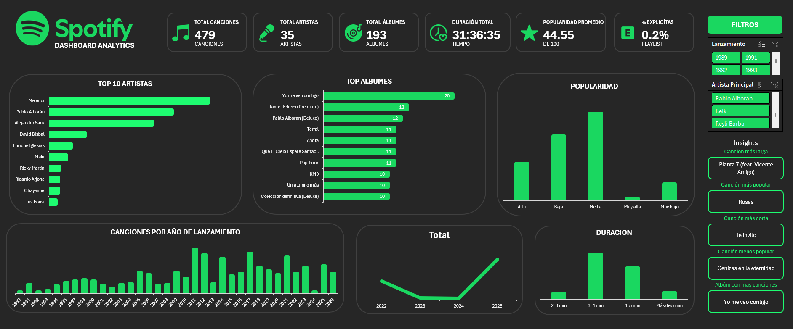
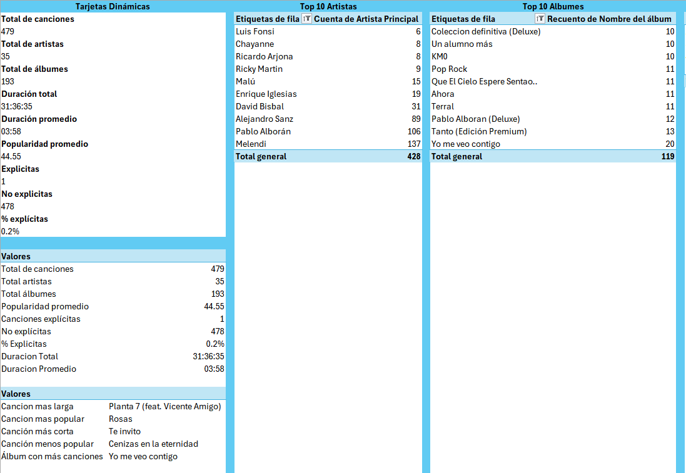
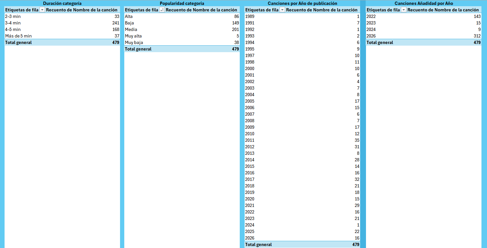
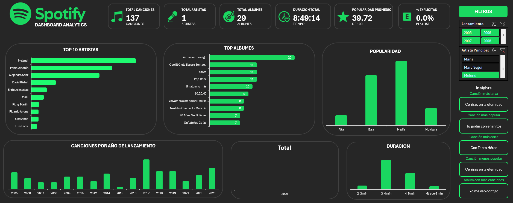

## 🎧 Music Streaming Content Analytics Dashboard
**Interactive Excel Data Analysis Project**

> *Transforming Spotify playlist data into actionable insights through data cleaning, modeling, DAX, and visualization.*
> 

# 📊 Dashboard Preview

# 💼 Business Problem

The increasing amount of data generated by music streaming platforms provides opportunities to identify patterns in content distribution, artist presence, song popularity, and other characteristics.

However, raw playlist data is not immediately suitable for analysis. It needs to be cleaned, transformed, structured, and presented in a way that allows users to easily explore the information and identify meaningful patterns.

This project addresses this challenge by transforming Spotify playlist data into an interactive analytical dashboard. The objective is to demonstrate how raw streaming data can be converted into a structured solution that supports the exploration of artists, songs, albums, popularity, duration, explicit content, and release periods.

# 📌 Project Overview

The **Spotify Music Analytics Dashboard** is an interactive data analysis project developed in Microsoft Excel to explore and understand the characteristics of a Spotify playlist.

The project analyzes **471 songs** after the data cleaning process, focusing on key aspects such as **artists, albums, song popularity, duration, and explicit content**.

The dashboard was designed to transform raw playlist data into meaningful and interactive insights. Users can select an **artist** and dynamically explore their songs, albums, popularity, duration, and other key metrics.

The project combines **data cleaning, transformation, data modeling, DAX calculations, and data visualization** to create an end-to-end analytics solution using Excel.

# 🎯 Objectives

The main objective of this project is to analyze a Spotify playlist and transform its raw data into an interactive and easy-to-understand dashboard.

The analysis aims to:

- Identify the artists with the highest presence in the playlist.
- Analyze song popularity and identify the most and least popular songs.
- Explore the distribution of songs across albums.
- Analyze total and average song duration.
- Measure the presence of explicit content within the playlist.
- Identify relevant song and album insights for each selected artist.
- Create an interactive dashboard that allows users to explore the data through an **Artist** slicer.
- Present the results through clear KPIs, charts, and dynamic insights.

# 📊 Dataset

The dataset used in this project was extracted from a Spotify playlist using **Exportify**, a tool that allows Spotify playlist data to be exported for further analysis.

After the data cleaning and transformation process, the final dataset contains **471 songs**.

The dataset includes information related to:

- Song titles
- Artists
- Albums
- Song popularity
- Song duration
- Release dates
- Explicit content
- Other Spotify-related attributes

The extracted data was prepared and transformed using **Power Query** before being incorporated into the Excel Data Model for analysis and visualization.

# 🧹 Data Cleaning & Transformation

The raw Spotify data required several cleaning and transformation steps before it could be used for analysis.

The data preparation process was performed using **Power Query** and included:

- Removing duplicate records.
- Cleaning unnecessary or inconsistent rows.
- Reviewing and transforming data types.
- Cleaning and standardizing relevant fields.
- Transforming song duration from milliseconds into a time format suitable for analysis.
- Preparing release date information for analysis.
- Creating an **Artist Principal** field to handle songs involving multiple artists.

### Artist Principal

Songs containing collaborations were assigned to a primary artist for analysis while preserving the original artist information.

For example:

`Melendi, Artist X` → `Melendi`

This approach allowed the dashboard to analyze artist performance consistently while maintaining the original data.

After the cleaning and transformation process, the final dataset contained **471 songs** and was ready to be loaded into the Excel Data Model for further analysis.

# 🧮 Data Modeling & DAX

After the data cleaning process, the dataset was incorporated into an **Excel Data Model using Power Pivot**.

The data model was used to create dynamic calculations with **DAX (Data Analysis Expressions)** and to ensure that the dashboard metrics respond correctly to user selections.

### Key Measures

The project includes DAX measures for:

- Total number of songs.
- Total number of artists.
- Total number of albums.
- Total playlist duration.
- Average song duration.
- Average song popularity.
- Explicit songs.
- Non-explicit songs.
- Explicit content percentage.

### Dynamic Insights

Additional DAX measures were created to generate insights based on the selected artist, including:

- Longest song.
- Shortest song.
- Most popular song.
- Least popular song.
- Album with the highest number of songs.

These calculations allow the dashboard to dynamically update its KPIs and insights when an artist is selected through the **Artist Principal** slicer.

The data model also keeps the **Top 10 Artists** analysis independent from the artist selection, allowing users to explore an individual artist while maintaining the overall ranking for comparison.

# 📈 Dashboard

The final dashboard was designed to provide an interactive and visual overview of the Spotify playlist.

Users can explore the playlist as a whole or apply different filters to analyze specific artists and album release periods.

### Key Dashboard Components

- **KPIs:** Display key metrics such as total songs, artists, albums, total duration, average duration, average popularity, and explicit content percentage.
- **Artist Slicer:** Allows users to select an artist and dynamically update the relevant metrics and insights.
- **Album Release Date Slicer:** Allows users to filter the analysis based on the release date of the albums associated with the songs in the playlist.
- **Top 10 Artists:** Shows the artists with the highest number of songs in the playlist while remaining independent from the artist selection.
- **Song Insights:** Provides dynamic information about the longest, shortest, most popular, and least popular songs for the selected artist.
- **Album Analysis:** Identifies the album with the highest number of songs for the selected artist.
- **Interactive Charts:** Visualize different aspects of the playlist, including artist distribution, album representation, popularity, song duration, and release dates.

### Interactive Analysis

The dashboard allows users to move from a general overview of the playlist to a more detailed analysis by applying interactive filters.

The **Artist Principal** slicer allows users to focus on a specific artist, while the **Album Release Date** slicer can be used to explore songs according to the release period of their corresponding albums.

The KPIs and dynamic insights update according to the selected filters, allowing users to explore different aspects of the dataset without manually modifying the underlying data.

The **Top 10 Artists** visualization remains independent from the artist selection, providing a consistent overview of the most represented artists in the playlist.

# 💡 Key Findings

### 🎵 Song Insights

The dashboard identifies the songs that stand out based on duration and popularity:

- **Longest Song:** *Planta 7 (feat. Vicente Amigo)*
- **Shortest Song:** *Te Invito*
- **Most Popular Song:** *Rosas*
- **Least Popular Song:** *Cenizas en la Eternidad*

### 💿 Album Representation

The album with the highest number of songs in the playlist is ***Yo Me Veo Contigo***, making it the most represented album in the dataset.

### 🎤 Artist Analysis

The **Top 10 Artists** visualization identifies the artists with the highest number of songs in the playlist, providing an overview of the artists with the strongest representation.

### 📅 Release Period Analysis

The **Album Release Date** slicer allows the playlist to be explored according to the release date of the albums associated with each song, making it possible to analyze how the playlist is distributed across different periods.

### 🔎 Dynamic Analysis

The dashboard also allows users to select an **Artist Principal** and dynamically update the relevant KPIs and song insights.

This makes it possible to move from a general overview of the playlist to a more focused analysis of an individual artist while keeping the **Top 10 Artists** ranking independent for comparison.

# ⚠️ Limitations

This project has several limitations that should be considered when interpreting the results:

- The analysis is based on a single Spotify playlist and therefore does not represent the entire Spotify music catalog.
- The dataset represents a specific point in time, so Spotify-related attributes may change over time.
- The analysis is limited to the fields available in the extracted dataset.
- Artist collaborations required the creation of an **Artist Principal** field to establish a consistent rule for artist-level analysis.
- The project was developed using Microsoft Excel, which may limit scalability compared with database or cloud-based analytical solutions.
- The dataset does not provide actual user listening behavior, so the analysis focuses on the characteristics of the playlist rather than real listening activity.

# 🚀 Future Improvements

Several improvements could be implemented in future versions of the project:

- Expand the analysis by incorporating multiple playlists or a larger dataset.
- Automate the data extraction and refresh process.
- Add additional Spotify attributes when available.
- Compare different playlists, artists, or release periods.
- Develop the dashboard in **Power BI** to provide more advanced interactive visualizations.
- Use **SQL** or a database solution to improve scalability and data management.
- Incorporate additional metrics related to listening behavior if user-level data becomes available.

### Dynamic Insights

One of the main features of the dashboard is its ability to update the insights based on the user's selections.

For example, selecting a specific artist automatically updates the relevant KPIs and song-level insights, while the release date filter allows users to narrow the analysis to specific periods.

This makes the dashboard useful not only for viewing overall playlist statistics, but also for exploring individual artists and identifying patterns within the dataset.

# 🛠️ Tools & Technologies

The project was developed using the following tools and technologies:

- **Microsoft Excel** — Used to build the interactive dashboard, PivotTables, PivotCharts, and overall data visualization.
- **Power Query** — Used for data cleaning, transformation, and preparation.
- **Power Pivot** — Used to create the Excel Data Model and manage the analytical structure of the dataset.
- **DAX (Data Analysis Expressions)** — Used to create dynamic measures, KPIs, and insights.
- **Exportify** — Used to extract the Spotify playlist data for analysis.
- **Flaticon** — Used as a source for the icons incorporated into the dashboard design.

# 📂 Project Structure

The project is organized into different folders to separate the dashboard, dataset, visual assets, and supporting documentation.

**Project structure:**

- **Dashboard/** — Contains the final Excel dashboard.
- **Data/** — Contains the dataset extracted from the Spotify playlist.
- **Images/** — Contains screenshots and visual assets used to showcase the project.
- **README.md** — Provides an overview of the project, methodology, tools, and key findings.

This structure keeps the project organized and makes it easier to navigate and understand the different components of the analysis.

# 🎨 Credits & Assets

**Data Source**

The Spotify playlist data used in this project was extracted using [**Exportify**](http://exportify.app).

**Icons & Visual Assets**

The icons used throughout the dashboard were sourced from [**Flaticon**](https://www.flaticon.es/) and used as visual elements to enhance the dashboard's design and usability.

**Dashboard Design**

The dashboard layout, data analysis, visualizations, KPIs, and interactive elements were designed and developed as part of this project using **Microsoft Excel**.
